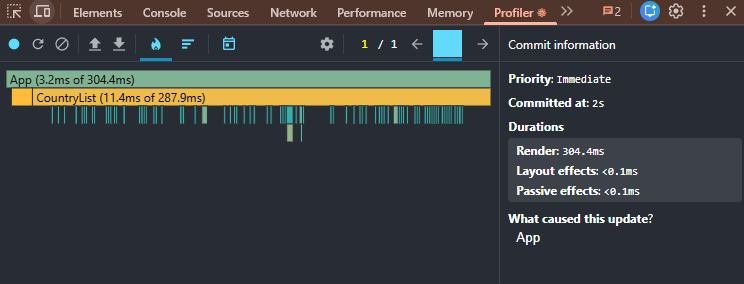
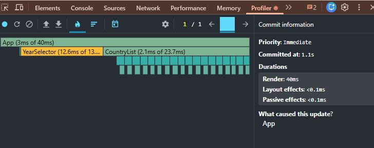
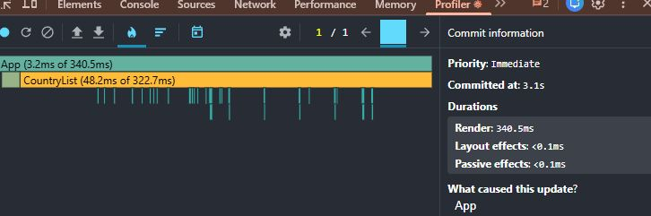
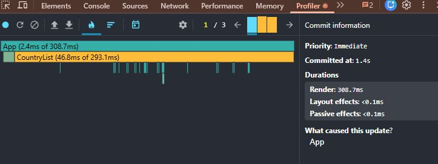
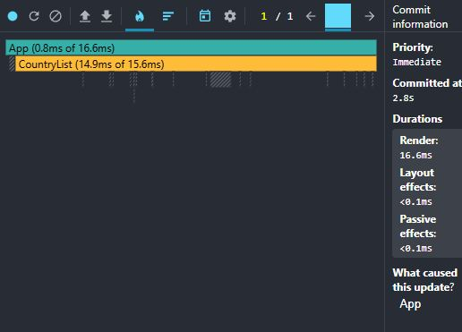
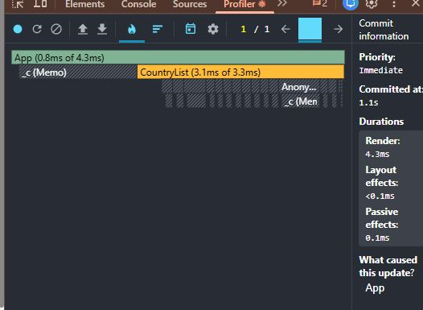
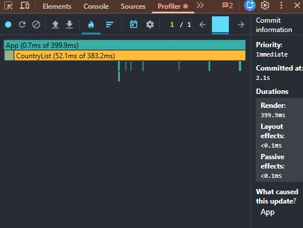
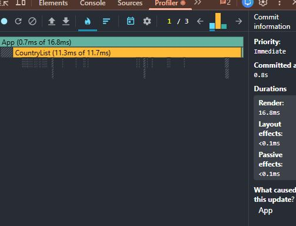

## Before

### Sort by name
- Render duration: 306.9 ms
- Commit duration: 306.9 ms
- Flame chart: 

### Search
- Render duration: 40 ms
- Commit duration: 40 ms
- Flame chart: 

### Year selection
- Render duration: 340.5 ms
- Commit duration: 340.5 ms
- Flame chart: 

### Column toggle
- Render duration: 308.7 ms
- Commit duration: 308.7 ms
- Flame chart: 

## After

### Sort by name
- Render duration: 16.6 ms
- Commit duration: 16.6 ms
- Flame chart: 

### Search
- Render duration: 4.3 ms
- Commit duration: 4.3 ms
- Flame chart: 

### Year selection
- Render duration: 399.9 ms
- Commit duration: 399.9 ms
- Flame chart: 

### Column toggle
- Render duration: 16.8 ms
- Commit duration: 16.8 ms
- Flame chart: 

| Sort | 306.9 ms | 16.6 ms | -94.6% |
| Search | 40 ms | 4.3 ms | -89.3% |
| Year selection | 340.5 ms | 399.9 ms | +17.4% |
| Column toggle | 308.7 ms | 16.8 ms | -94.6% |

## Conclusion

witohut VIRTUALIZATION
After adding memoization and stable keys,
3 of 4 tests improved.
Year selection got slightly worse because
changing the year updates a prop on every card. All memoized cards must
re-render with new data, and useMemo only adds overhead.